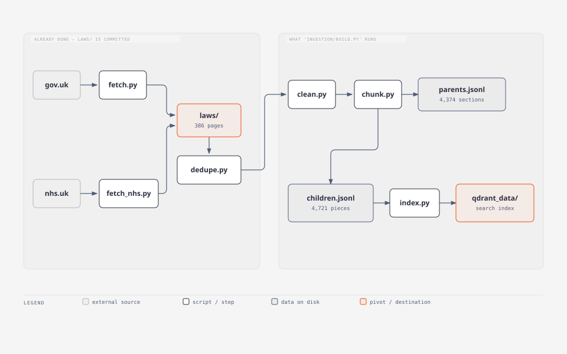
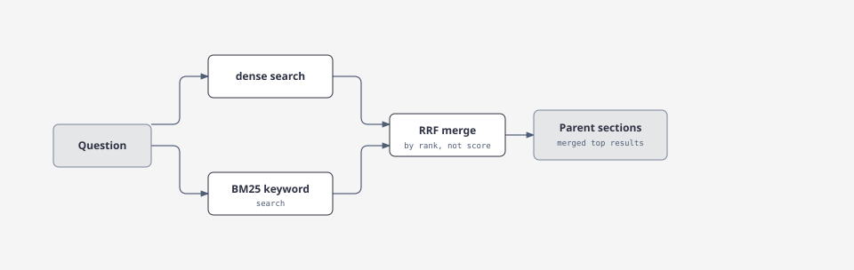
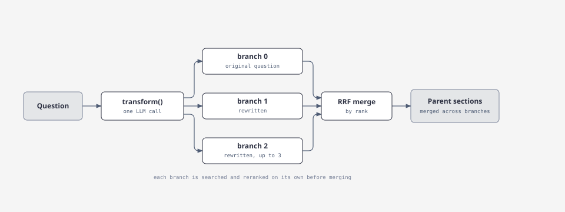
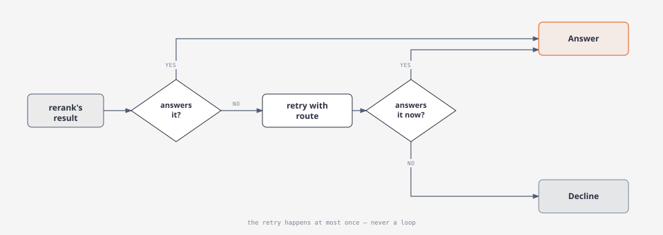
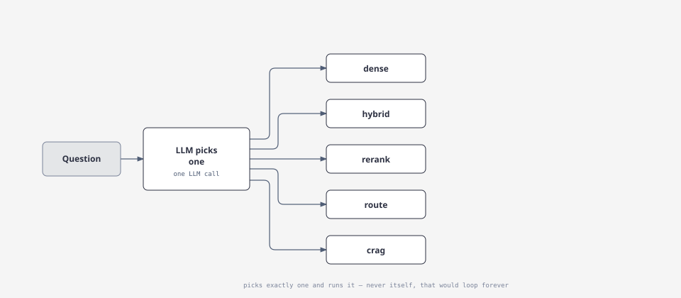

# UK Law RAG

A retrieval-augmented question-answering system for navigating UK administrative and legal rules — visas, tax, housing, banking, employment rights, the NHS, and education — grounded entirely in [gov.uk](https://www.gov.uk) and [nhs.uk](https://www.nhs.uk) content.

Six retrieval strategies are implemented and empirically benchmarked against a 39-question evaluation set, from a plain dense-vector baseline up to a Corrective RAG (CRAG) pipeline that grades its own retrieval and can decline to answer rather than guess.

> Built after relocating to the UK and repeatedly hitting the same wall: official guidance exists, but finding the *right* page for a specific situation is hard. This project is a portfolio piece exploring what it actually takes to make retrieval reliable enough to trust, not just plausible enough to demo.

---

## Table of contents

- [Setup](#setup)
- [Architecture](#architecture)
  - [Small-to-big retrieval, in detail](#small-to-big-retrieval-in-detail)
  - [Module layout and the import contract](#module-layout-and-the-import-contract)
- [The 6 pipelines](#the-6-pipelines)
- [Inside `route`](#inside-route)
- [Why CRAG wins](#why-crag-wins)
- [Why the agentic router underperformed](#why-the-agentic-router-underperformed)
- [Evaluation methodology](#evaluation-methodology)
- [Project structure](#project-structure)
- [Design decisions & tradeoffs](#design-decisions--tradeoffs)
- [Roadmap](#roadmap)
- [License](#license)

---

## Setup

### Prerequisites

- Python 3.12+
- [`uv`](https://docs.astral.sh/uv/) for dependency management
- A [DeepInfra](https://deepinfra.com) API key (used for LLM calls — query grading, CRAG's judge, generation)

### 1. Clone and install

```bash
git clone https://github.com/Harshkawade007/UK-LAW-RAG.git
cd UK-LAW-RAG
uv sync
```

`uv.lock` is committed, so `uv sync` reproduces the exact dependency versions the benchmark numbers below were measured against.

### 2. Configure environment variables

Create a `.env` file in the project root:

```bash
DEEPINFRA_TOKEN=your_token_here
```

> See [`.env.example`](./.env.example) for the full list of variables your code actually reads — this is the one required to run any pipeline that makes an LLM call (route, CRAG, agentic, generation). Building the index and the free eval pipelines (dense, hybrid, rerank) need no token at all.

### 3. Build the index

Turning the raw corpus into something searchable is a five-step pipeline — fetch pages, remove duplicates, strip them to plain text, split them into pieces, then embed and store those pieces:



What each step actually does:

- **`fetch.py` / `fetch_nhs.py`** — download pages from gov.uk's Content API and scrape nhs.uk's HTML, writing one JSON file per page into `laws/<category>/`. Two different fetchers because the sources are structurally different: one is an API, the other has to be scraped. Both write the same file shape, so cleaning and chunking treat them uniformly. Filenames encode the source path (`student-visa/family-members` → `student-visa__family-members.json`), which is how re-runs know what already exists — fetching is idempotent unless `--force`.
- **`dedupe.py`** — the same page can get crawled under two categories (e.g. a general money page found by both `banking` and `housing`); this keeps one copy in the most specific category and deletes the rest, so duplicates don't skew search results or the eval scores.
- **`clean.py`** — strips the raw HTML down to plain text, but keeps section headings as `## ` markers, because that's exactly what the next step splits on.
- **`chunk.py`** — splits each page into sections on those headings, then packs each section into ~250-token pieces. This produces **two files**: `parents.jsonl` (the full sections — what the LLM eventually reads) and `children.jsonl` (the small pieces — what actually gets searched; see [small-to-big retrieval](#small-to-big-retrieval-in-detail) below for why they're different sizes).
- **`index.py`** — turns every child chunk into a 384-number vector and writes it into `qdrant_data/`, the database every search pipeline actually queries.

**Fetching and deduping only need to happen once, and their output (`laws/`) is committed to the repo** — so a fresh clone never has to touch gov.uk or nhs.uk to get a working system. `ingestion/build.py` runs everything from `clean` onward, always in that order.

⚠️ **`dedupe` must run before `clean`, or the failure is silent.** `clean.py` skips any output that already exists and never prunes stale ones — so cleaning first leaves an orphan in `cleaned/` that `chunk.py` then indexes, reintroducing the exact duplicate `dedupe` was meant to remove. Nothing errors. `ingestion/build.py` enforces the order and prunes orphans after any fetch, which is why a script enforcing the order is safer than three commands typed by hand:

```bash
python ingestion/build.py
```

Useful flags:

```bash
python ingestion/build.py --force         # rebuild ignoring existing outputs
python ingestion/build.py --from chunk    # resume partway (skip clean)
python ingestion/build.py --fetch         # re-fetch + dedupe first, then clean → chunk → index
```

> ⚠️ **`--fetch` changes the corpus.** All benchmark numbers in this README, and the test set's expected answers, are measured against the pinned `laws/` snapshot. Re-fetching can add, remove, or shift content, which silently invalidates them. `--fetch` prints a warning and asks for confirmation before running — that's intentional, not a bug.

### 4. Run it

**Backend + frontend (one process, FastAPI):**

```bash
uvicorn api.main:app
```

Open `http://127.0.0.1:8000` — the same app serves the web UI (`api/static/index.html`) directly, no separate step needed.

**CLI (quick single-question check):**

```bash
python ask.py "Do full-time students have to pay Council Tax?"
```

### 5. Run the evaluation harness

```bash
python -m eval.run_eval              # rerank alone — fast, free, no LLM calls
python -m eval.run_eval all          # every pipeline — reproduces the full table below
```

---

## Architecture


**The core retrieval trick — small-to-big:** only the small ~250-token *child* chunks are embedded and searched. Each child links to its full *parent* section, which is what actually gets handed to the LLM for generation. Children are precise search targets; parents give the model the surrounding context — including caveats a lone sentence would misrepresent. (Example that motivated this: a chunk reading *"you do not have to protect a holding deposit"* is dangerous read alone, safe read inside its full section.)

**Everything is grounded, nothing is generated from open knowledge.** Answers cite the retrieved gov.uk/nhs.uk sections directly, and CRAG can decline to answer if nothing retrieved actually addresses the question.


### Small-to-big retrieval, in detail


**Only children are embedded.** Embedding a full parent section was measured to blur retrieval: a long section averages out to a vector that matches everything weakly and nothing precisely. Parents stay in a plain dict (`chunks/parents.jsonl`), looked up by id after a child matches — never embedded, never searched directly.

Children are precise enough to match but not safe to read alone: `tenancy-deposit-protection#4` says *"your landlord does not have to protect a holding deposit"* — true of holding deposits, dangerously wrong as an answer about tenancy deposits. The surrounding section carries the caveat.

`top_k` counts **unique parents**, not child hits. Several children often share one section, so a pool of 25 children can collapse to far fewer results — which is also why the reranker scores the *whole* pool and lets `expand_to_parents()` do the cutting. Truncating children first can yield fewer than `top_k` sections.


---

## The 6 pipelines

Each one is the previous one plus a stage. Here's what each stage actually does.

| Pipeline | What it adds over the previous stage | MRR@5 |
|---|---|---|
| `dense` | Plain vector search (baseline) | 0.6599 |
| `hybrid` | + BM25 keyword search, fused via RRF | 0.5784 |
| `rerank` | + cross-encoder reranking | 0.6608 |
| `route` | + LLM query rewriting into multiple search branches | 0.4486 |
| **`crag`** | + LLM grades the retrieval; escalates to `route` once if poor | **0.6743** |
| `agentic` | An LLM picks one of the five pipelines per query | 0.6473 |

CRAG is the best single-pipeline performer measured, and the default for anything a human actually reads (`ask.py`, the web UI) — despite costing ~3.7s vs rerank's ~0.8s (warm; both are dominated by their LLM round-trip or lack of one, not local compute) — because it's the only pipeline that can decline to answer instead of confidently returning a wrong section.

An **oracle ceiling** — the theoretical maximum MRR if a perfect per-query router always picked the best-performing pipeline for that specific query — sits above all of these, and is the benchmark the router work is measured against.

### `dense`

Turns the question into a list of numbers and finds the chunks whose numbers point in a similar direction. No LLM calls, and fast — but it can blur together things that read alike and mean different things, like a Student visa and a Child Student visa.


### `hybrid`

Runs `dense` and a keyword search (BM25) side by side, then merges the two ranked lists. Catches exact terms and numbers that dense search smooths over — but keyword search can be confidently wrong, which is why this alone sometimes scores *worse* than dense on its own.



### `rerank`

Takes `hybrid`'s shortlist and re-reads every candidate against the question with a cross-encoder — a model that looks at the question and the chunk *together*, instead of comparing them from a distance. Slower, but this is what actually tells two similarly-worded options apart.


### `route`

One cheap LLM call rewrites the question into the wording gov.uk actually uses, and splits it into separate questions if it's genuinely asking about two things. Each rewritten question is searched and reranked on its own, then the results are merged. Powerful in theory — measured, it's the weakest pipeline, since rewrites don't always help casual phrasing. See [Inside `route`](#inside-route) below for exactly why.



---

## Inside `route`

```
question
   │
   ├─ transform()   ONE cheap LLM call (Llama-3.1-8B, ~2.4s)
   │                rewrites into gov.uk wording
   │                splits ONLY if genuinely 2+ topics (max 3)
   │                tags each piece with categories
   │                any failure → returns [] → degrades to plain rerank
   ↓
branches
   ├─ branch 0   ORIGINAL query, NO category filter    ← ALWAYS present
   ├─ branch 1   rewritten query   [housing]
   └─ branch N   rewritten query   [...]
   ↓
each branch runs INDEPENDENTLY and finishes before merging:
   │
   │   hybrid search (dense + BM25 → RRF) → pool of children     ~47ms
   │        ↓
   │   rerank against ITS OWN query (cross-encoder)             ~900ms
   │        ↓
   │   one ranked list
   ↓
[merge]  RRF across the branch RANK POSITIONS  (k=60, cap MERGE_POOL=30)
   │     ranks, not scores — scores from different queries aren't comparable
   ↓
expand_to_parents → top 5 sections
```

Three invariants — break any of them and it silently degrades:

1. **Branch 0 exists because category labels lie.** A page's category came from which crawl list found it, not what it's about. `National Insurance: introduction` is filed under `visa`; every Council Tax page is under `housing`. Ask *"how do I get a National Insurance number"* and the LLM confidently routes to `tax_ni`, which would bury the NI intro page — branch 0 searches everything unfiltered, and it came back at rank 2 anyway. Routing may reorder results; it can never delete them.
2. **Rerank per branch, not once at the end.** Merging first and reranking once against the user's question reintroduces the exact vocabulary gap the rewrite exists to close. For *"can I work extra during reading week?"* the rewrite correctly pulls in `Student visa > What you can and cannot do`, then scoring it against "reading week" ranks it below `Maximum weekly working hours` — unrelated, but it shares the words work/hours/week. Each branch is judged against the query that produced it; branch 0 is the original, so the user's wording still gets a full vote, just not a veto.
3. **`transform()` returning `[]` is a valid outcome, not an error.** A bad token, a timeout or malformed JSON leaves exactly one branch, which is precisely `mode="rerank"`. Every LLM call site in this system degrades the same way: a broken model falls back to previous behaviour, it never breaks the search.

**What was actually measured:** `route` is the weakest pipeline (MRR 0.4486, hit-rate 25/37 against rerank's 31/37) — colloquial phrasing frequently pushes the rewrite *away* from corpus vocabulary or over-splits it. It's also **not deterministic**: despite `temperature=0`, DeepInfra makes no determinism guarantee, so the same question yields a different number of sub-queries run to run. Over three identical runs its MRR spanned 0.6520–0.7078 — a spread larger than most effects being measured. It's kept for two concrete reasons: `crag` escalates to it, and it's the only pipeline that finds 2 of the test questions at all.

### `crag`

Runs `rerank`, then has an LLM check whether the result actually *answers* the question rather than just resembling it. If the check comes back weak, it retries once with `route`. This is the only pipeline that can honestly say "I don't know" instead of guessing — and it's the default everywhere a person reads the output. See [Why CRAG wins](#why-crag-wins) below for the full mechanics.



### `agentic`

One LLM call reads the question and picks which of the other five pipelines to run. The idea was to get the best of all five automatically — measured, it actually scored *worse* than simply always using `crag`, and is kept as a documented example of an idea that didn't pan out. See [Why the agentic router underperformed](#why-the-agentic-router-underperformed) below for the full story.



---

### Module layout and the import contract

```
retrieval/
  store.py      shared: embedding model, Qdrant client, parents.jsonl,
                embed_query(), expand_to_parents(), close()
  dense.py      pipeline 1
  hybrid.py     pipeline 2      imports dense
  rerank.py     pipeline 3      imports hybrid
  route.py      pipeline 4      imports hybrid + rerank + transform
  crag.py       pipeline 5      imports rerank + route + agent.grade
  agentic.py    the selector    imports search.py LAZILY
  transform.py  the LLM rewrite call route.py uses
  search.py     the dispatcher — PIPELINES dict, retrieve, retrieve_traced
```

Every pipeline module implements one contract:

```python
run(question, top_k=5, categories=None, pool=25) -> (parents, trace | None)
```


---

## Why CRAG wins

Every other scoring stage in this system — cosine similarity, BM25, even the cross-encoder — measures how *closely* a chunk matches a question, not whether it *answers* it. On the 39-question test set, the cross-encoder's top-1 score doesn't separate hits from misses at all:

```
correct at rank 1 : 6.15 – 9.57
complete miss      : 6.22 – 9.34
```

The clearest example: for *"Does my landlord have to protect my deposit?"*, retrieval returns a section on **holding deposits** at rank 1, scoring near the top of the entire dataset — and that section says the landlord does **not** have to protect a holding deposit. Lexically near-identical to the question, semantically the opposite answer. No numeric threshold separates that from a genuine hit.

CRAG's fix: an LLM reads the retrieved sections and grades them `relevant` / not, rather than trusting a similarity score. If the grade is poor, it escalates **once** to the `route` pipeline — deliberately the *weakest* pipeline by raw MRR, chosen because query rewriting gives a genuinely different angle on a missed query, and because escalation is rare (~8% of queries) with zero measured false positives in the grader across two full eval runs. The escalated result is re-graded before being returned, since the whole point of escalation is that it can turn an `irrelevant` verdict into a `relevant` one — the deposit example above is recovered this way.

**There are two grades, and conflating them would break the escalation logic:**

| field | means | read by |
|---|---|---|
| `grade` | was the **first attempt** good? | decides whether to escalate |
| `final_grade` | is what I'm **about to show you** good? | decides answer vs. decline |

They differ exactly when escalation *worked* — the deposit question above grades `irrelevant`, escalates, comes back correct at rank 1, and is re-graded `relevant`. Refusing on the pre-escalation grade would throw away a good answer.

The original Corrective RAG paper falls back to open web search on a poor grade. That would break this system's citation-faithfulness guarantee — every claim has to trace to a section in the trusted corpus — so the fallback here stays *inside* the corpus and escalates to `route` instead.

If the corpus can't answer a question even after escalation, CRAG declines rather than generating a guess — and only `irrelevant` declines; `partial` still answers, since some section genuinely helps and the generation prompt already instructs the model to say what's missing.

⚠️ **The grader itself isn't perfectly deterministic.** With retrieval held fixed, five consecutive grading calls on the same question returned `irrelevant` ×4 and `partial` ×1; a separate run returned `relevant`. Since only `irrelevant` triggers a decline, the same out-of-corpus question can occasionally still get answered. Making this fully reliable would mean majority-voting over several grading calls, or moving the grader to the larger model — neither is measured yet, so refusal should be read as a strong signal, not a guarantee.

---

## Why the agentic router underperformed

The natural next idea after benchmarking six fixed pipelines is: *have an LLM pick the best pipeline per query.* This was built and measured — the `agentic` pipeline — and it came in at 0.6473, **below** the simple "always use CRAG" baseline (0.6743).

The opportunity looked real going in: an oracle that always picked the best-performing pipeline per question would score 0.8221, a bigger gap than any single retrieval technique closed. But the LLM selector never got close to it. Two prompt iterations were tried and then deliberately stopped: the first framed CRAG as a narrow edge case and the selector almost never picked it (MRR 0.6009); the second made CRAG the explicit default and recovered most of the loss (0.6473) — still below just always running it.

**Diagnosed failure mode:** query text alone doesn't carry enough signal to predict which pipeline will win on that specific question — two lexically similar questions can have very different retrieval difficulty, and reading only the question text can't reliably tell which pipeline that maps to. A third round of prompt tuning was skipped on purpose: pushing the score up on the same 39 questions it's scored against is overfitting, not a real fix. The honest conclusion is that the oracle headroom is real but isn't reachable by guessing from the question alone — capturing it would mean running pipelines and comparing results, not picking one upfront.

---

## Evaluation methodology

A custom 39-question harness (`eval/run_eval.py`) computes **MRR@5** (Mean Reciprocal Rank) against hand-labeled expected answer sections, reused as-is across pipeline comparisons and embedding model benchmarks. A separate **comparison panel** runs all pipelines simultaneously on the same query, deduplicates overlapping retrieved chunks, and has a 70B judge LLM rate each unique chunk once — ratings are then mapped back per pipeline, so every pipeline is graded against the same judgments rather than independently.

---

## Project structure

```
UK-LAW-RAG/
├── ask.py                   # CLI: ask a single question
├── api/
│   ├── main.py                # FastAPI app + serves the web UI (uvicorn api.main:app)
│   ├── schemas.py              # request/response models
│   └── static/index.html       # the whole frontend — one file, no build step
├── ingestion/
│   ├── build.py                # entry point: clean → chunk → index (+ optional --fetch)
│   ├── fetch.py                # gov.uk Content API crawler
│   ├── fetch_nhs.py            # nhs.uk HTML scraper
│   ├── sources.py              # seed URLs per category
│   ├── dedupe.py
│   ├── clean.py
│   ├── chunk.py                # small-to-big chunking
│   └── index.py                # embed children, build Qdrant index
├── retrieval/
│   ├── store.py                # shared: model, Qdrant client, parent lookup
│   ├── dense.py
│   ├── hybrid.py
│   ├── rerank.py
│   ├── route.py
│   ├── crag.py
│   ├── agentic.py
│   ├── transform.py            # LLM query rewriting used by route.py
│   └── search.py                # pipeline dispatcher
├── agent/
│   ├── generate.py              # final answer generation
│   ├── grade.py                 # LLM-based retrieval grading (used by crag.py)
│   ├── select.py                # LLM pipeline chooser (used by agentic.py)
│   └── review.py                # judges all pipelines for the /compare panel
├── eval/
│   ├── testset.py               # the 39 questions + expected sections
│   └── run_eval.py              # the MRR harness
├── laws/                        # pinned raw corpus (committed)
├── cleaned/                     # laws/ with HTML stripped (generated)
├── chunks/                      # children.jsonl / parents.jsonl (generated)
├── qdrant_data/                 # local Qdrant index (generated)
├── uv.lock
└── pyproject.toml
```

---

## Design decisions & tradeoffs

- **Small-to-big retrieval** — search precise ~250-token children, return their full parent section for generation, so context and caveats survive.
- **`laws/` is pinned, not live-fetched per query** — every benchmark number in this README is only reproducible because the corpus is frozen. `--fetch` is a deliberate, guarded, opt-in operation.
- **Dedupe runs before clean** — `clean.py` skips outputs that already exist and never prunes stale ones; deduping after cleaning leaves orphaned cleaned copies of deleted duplicates, which get silently re-indexed.
- **CRAG escalates to the weakest pipeline (`route`) by design** — works only because escalation is rare and the grader has zero measured false positives; this is explicitly flagged as a decision to revisit if `route`'s standalone performance degrades further.
- **Embedding constants are duplicated between `ingestion/index.py` and `retrieval/store.py`**, not imported — `ingestion/` scripts run standalone from their own folder by design, so importing across that boundary isn't straightforward. Both files must be updated together when the embedding model changes, or queries and the index land in different vector spaces with no error, just silently degraded retrieval.
- **No LangChain, no agent framework** — HTML cleaning is BeautifulSoup, chunking and every retrieval pipeline are hand-written. Slower to build than reaching for a framework, but every step is explainable rather than hidden behind an abstraction.
- **Query rewriting always runs** in the pipelines that use it, not conditionally — natural user phrasing and well-formed retrieval queries differ structurally often enough that it isn't worth trying to detect when rewriting is "needed."

---

## Roadmap

- Manually review CRAG failure cases to check whether domain misclassification explains underperformance, before building a top-k domain-widening feature
- Benchmark open embedding models via HuggingFace's Inference Providers API against the existing 39-question harness
- Measure answer faithfulness, not just retrieval — every number in this README scores retrieval; whether generated answers stay faithful to their cited sections is untested
- Deploy via Docker on EC2

---

## License

See [`LICENSE`](./LICENSE) for details.