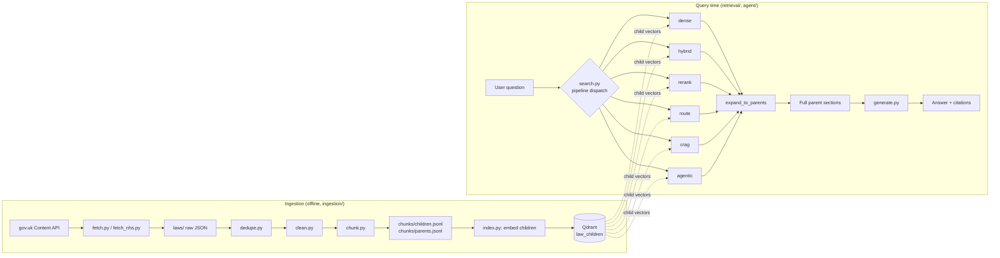

# UK Law RAG

A retrieval-augmented question-answering system for navigating UK administrative and legal rules — visas, tax, housing, banking, employment rights, the NHS, and education — grounded entirely in [gov.uk](https://www.gov.uk) and [nhs.uk](https://www.nhs.uk) content.

Six retrieval strategies are implemented and empirically benchmarked against a 39-question evaluation set, from a plain dense-vector baseline up to a Corrective RAG (CRAG) pipeline that grades its own retrieval and can decline to answer rather than guess.

> Built after relocating to the UK and repeatedly hitting the same wall: official guidance exists, but finding the *right* page for a specific situation is hard. This project is a portfolio piece exploring what it actually takes to make retrieval reliable enough to trust, not just plausible enough to demo.

---

## Table of contents

- [Setup](#setup)
- [Architecture](#architecture)
- [The six retrieval pipelines](#the-six-retrieval-pipelines)
- [Why CRAG wins](#why-crag-wins)
- [Why the agentic router underperformed](#why-the-agentic-router-underperformed)
- [Evaluation methodology](#evaluation-methodology)
- [Project structure](#project-structure)
- [Design decisions & tradeoffs](#design-decisions--tradeoffs)
- [Roadmap](#roadmap)
- [License](#license)

---

## Setup

### Prerequisites

- Python 3.12+
- [`uv`](https://docs.astral.sh/uv/) for dependency management
- A [DeepInfra](https://deepinfra.com) API key (used for LLM calls — query grading, CRAG's judge, generation)

### 1. Clone and install

```bash
git clone https://github.com/Harshkawade007/UK-LAW-RAG.git
cd UK-LAW-RAG
uv sync
```

`uv.lock` is committed, so `uv sync` reproduces the exact dependency versions the benchmark numbers below were measured against.

### 2. Configure environment variables

Create a `.env` file in the project root:

```bash
DEEPINFRA_TOKEN=your_token_here
```

> See [`.env.example`](./.env.example) for the full list of variables your code actually reads — this is the one required to run any pipeline that makes an LLM call (route, CRAG, agentic, generation). Building the index and the free eval pipelines (dense, hybrid, rerank) need no token at all.

### 3. Build the index

The corpus (`laws/`) is committed to the repo, so a fresh clone can build the full index offline, with no API calls and no re-fetching from gov.uk:

```bash
python ingestion/build.py
```

This runs `clean → chunk → index` against the pinned `laws/` corpus and reports timing per step. Useful flags:

```bash
python ingestion/build.py --force         # rebuild ignoring existing outputs
python ingestion/build.py --from chunk    # resume partway (skip clean)
python ingestion/build.py --fetch         # refresh the corpus first: fetch → dedupe → clean → chunk → index
```

> ⚠️ **`--fetch` changes the corpus.** All benchmark numbers in this README are measured against the pinned `laws/` snapshot. Re-fetching can add, remove, or shift content, which invalidates the evaluation set's expected answers. `--fetch` prints a warning and asks for confirmation before running — this is intentional, not a bug.

### 4. Run it

**Backend + frontend (one process, FastAPI):**

```bash
uvicorn api.main:app
```

⚠️ **Don't add `--reload` or `--workers > 1`.** The vector database runs embedded, holding a lock on `qdrant_data/`, so a second process fails to start.

Open `http://127.0.0.1:8000` — the same app serves the web UI (`api/static/index.html`) directly, no separate step needed.

**CLI (quick single-question check):**

```bash
python ask.py "Do full-time students have to pay Council Tax?"
```

### 5. Run the evaluation harness

```bash
python -m eval.run_eval              # rerank alone — fast, free, no LLM calls
python -m eval.run_eval all          # every pipeline — reproduces the full table below
```

---

## Architecture



**The core retrieval trick — small-to-big:** only the small ~250-token *child* chunks are embedded and searched. Each child links to its full *parent* section, which is what actually gets handed to the LLM for generation. Children are precise search targets; parents give the model the surrounding context — including caveats a lone sentence would misrepresent. (Example that motivated this: a chunk reading *"you do not have to protect a holding deposit"* is dangerous read alone, safe read inside its full section.)

**Everything is grounded, nothing is generated from open knowledge.** Answers cite the retrieved gov.uk/nhs.uk sections directly, and CRAG can decline to answer if nothing retrieved actually addresses the question.

**The web UI shows the reasoning, not just the answer.** `/chat` returns a `trace` field alongside the answer — the sub-queries `route` actually searched, the grade `crag` gave and whether that triggered a retry, which pipeline `agentic` picked and why — and the page renders it above the sources. This is the only place any of that decision-making is visible from the outside; every other mode returns `trace: null` since it made no decision to show.

---

## The six retrieval pipelines

| Pipeline | What it adds over the previous stage | MRR@5 |
|---|---|---|
| `dense` | Plain vector search (baseline) | 0.6599 |
| `hybrid` | + BM25 keyword search, fused via RRF | 0.5784 |
| `rerank` | + cross-encoder reranking | 0.6608 |
| `route` | + LLM query rewriting into multiple search branches | 0.4486 |
| **`crag`** | + LLM grades the retrieval; escalates to `route` once if poor | **0.6743** |
| `agentic` | An LLM picks one of the five pipelines per query | 0.6473 |

CRAG is the best single-pipeline performer measured, and the default for anything a human actually reads (`ask.py`, the web UI) — despite costing ~3.7s vs rerank's ~0.8s (warm; both are dominated by their LLM round-trip or lack of one, not local compute) — because it's the only pipeline that can decline to answer instead of confidently returning a wrong section.

An **oracle ceiling** — the theoretical maximum MRR if a perfect per-query router always picked the best-performing pipeline for that specific query — sits above all of these, and is the benchmark the router work below is measured against.

---

## Why CRAG wins

Every other scoring stage in this system — cosine similarity, BM25, even the cross-encoder — measures how *closely* a chunk matches a question, not whether it *answers* it. On the 39-question test set, the cross-encoder's top-1 score doesn't separate hits from misses at all:

```
correct at rank 1 : 6.15 – 9.57
complete miss      : 6.22 – 9.34
```

The clearest example: for *"Does my landlord have to protect my deposit?"*, retrieval returns a section on **holding deposits** at rank 1, scoring near the top of the entire dataset — and that section says the landlord does **not** have to protect a holding deposit. Lexically near-identical to the question, semantically the opposite answer. No numeric threshold separates that from a genuine hit.

CRAG's fix: an LLM reads the retrieved sections and grades them `relevant` / not, rather than trusting a similarity score. If the grade is poor, it escalates **once** to the `route` pipeline — deliberately the *weakest* pipeline by raw MRR, chosen because query rewriting gives a genuinely different angle on a missed query, and because escalation is rare (~8% of queries) with zero measured false positives in the grader across two full eval runs. The escalated result is re-graded before being returned, since the whole point of escalation is that it can turn an `irrelevant` verdict into a `relevant` one — the deposit example above is recovered this way.

If the corpus can't answer a question even after escalation, CRAG says so honestly rather than generating a guess.

---

## Why the agentic router underperformed

The natural next idea after benchmarking six fixed pipelines is: *have an LLM pick the best pipeline per query.* This was built and measured — the `agentic` pipeline — and it came in at 0.6473, **below** the simple "always use CRAG" baseline (0.6743).

The opportunity looked real going in: an oracle that always picked the best-performing pipeline per question would score 0.8221, a bigger gap than any single retrieval technique closed. But the LLM selector never got close to it. Two prompt iterations were tried and then deliberately stopped: the first framed CRAG as a narrow edge case and the selector almost never picked it (MRR 0.6009); the second made CRAG the explicit default and recovered most of the loss (0.6473) — still below just always running it.

**Diagnosed failure mode:** query text alone doesn't carry enough signal to predict which pipeline will win on that specific question — two lexically similar questions can have very different retrieval difficulty, and reading only the question text can't reliably tell which pipeline that maps to. A third round of prompt tuning was skipped on purpose: pushing the score up on the same 39 questions it's scored against is overfitting, not a real fix. The honest conclusion is that the oracle headroom is real but isn't reachable by guessing from the question alone — capturing it would mean running pipelines and comparing results, not picking one upfront.

---

## Evaluation methodology

A custom 39-question harness (`eval/run_eval.py`) computes **MRR@5** (Mean Reciprocal Rank) against hand-labeled expected answer sections, reused as-is across pipeline comparisons and embedding model benchmarks. A separate **comparison panel** runs all pipelines simultaneously on the same query, deduplicates overlapping retrieved chunks, and has a 70B judge LLM rate each unique chunk once — ratings are then mapped back per pipeline, so every pipeline is graded against the same judgments rather than independently.

---

## Project structure

```
UK-LAW-RAG/
├── ask.py                   # CLI: ask a single question
├── api/
│   ├── main.py                # FastAPI app + serves the web UI (uvicorn api.main:app)
│   ├── schemas.py              # request/response models
│   └── static/index.html       # the whole frontend — one file, no build step
├── ingestion/
│   ├── build.py                # entry point: clean → chunk → index (+ optional --fetch)
│   ├── fetch.py                # gov.uk Content API crawler
│   ├── fetch_nhs.py            # nhs.uk HTML scraper
│   ├── sources.py              # seed URLs per category
│   ├── dedupe.py
│   ├── clean.py
│   ├── chunk.py                # small-to-big chunking
│   └── index.py                # embed children, build Qdrant index
├── retrieval/
│   ├── store.py                # shared: model, Qdrant client, parent lookup
│   ├── dense.py
│   ├── hybrid.py
│   ├── rerank.py
│   ├── route.py
│   ├── crag.py
│   ├── agentic.py
│   ├── transform.py            # LLM query rewriting used by route.py
│   └── search.py                # pipeline dispatcher
├── agent/
│   ├── generate.py              # final answer generation
│   ├── grade.py                 # LLM-based retrieval grading (used by crag.py)
│   ├── select.py                # LLM pipeline chooser (used by agentic.py)
│   └── review.py                # judges all pipelines for the /compare panel
├── eval/
│   ├── testset.py               # the 39 questions + expected sections
│   └── run_eval.py              # the MRR harness
├── laws/                        # pinned raw corpus (committed)
├── cleaned/                     # laws/ with HTML stripped (generated)
├── chunks/                      # children.jsonl / parents.jsonl (generated)
├── qdrant_data/                 # local Qdrant index (generated)
├── uv.lock
└── pyproject.toml
```

---

## Design decisions & tradeoffs

- **Small-to-big retrieval** — search precise ~250-token children, return their full parent section for generation, so context and caveats survive.
- **`laws/` is pinned, not live-fetched per query** — every benchmark number in this README is only reproducible because the corpus is frozen. `--fetch` is a deliberate, guarded, opt-in operation.
- **Dedupe runs before clean** — `clean.py` skips outputs that already exist and never prunes stale ones; deduping after cleaning leaves orphaned cleaned copies of deleted duplicates, which get silently re-indexed.
- **CRAG escalates to the weakest pipeline (`route`) by design** — works only because escalation is rare and the grader has zero measured false positives; this is explicitly flagged as a decision to revisit if `route`'s standalone performance degrades further.
- **Embedding constants are duplicated between `ingestion/index.py` and `retrieval/store.py`**, not imported — `ingestion/` scripts run standalone from their own folder by design, so importing across that boundary isn't straightforward. Both files must be updated together when the embedding model changes, or queries and the index land in different vector spaces with no error, just silently degraded retrieval.
- **No LangChain, no agent framework** — HTML cleaning is BeautifulSoup, chunking and every retrieval pipeline are hand-written. Slower to build than reaching for a framework, but every step is explainable rather than hidden behind an abstraction.
- **Query rewriting always runs** in the pipelines that use it, not conditionally — natural user phrasing and well-formed retrieval queries differ structurally often enough that it isn't worth trying to detect when rewriting is "needed."

---

## Roadmap

- Manually review CRAG failure cases to check whether domain misclassification explains underperformance, before building a top-k domain-widening feature
- Benchmark open embedding models via HuggingFace's Inference Providers API against the existing 39-question harness
- Measure answer faithfulness, not just retrieval — every number in this README scores retrieval; whether generated answers stay faithful to their cited sections is untested
- Deploy via Docker on EC2

---

## License

See [`LICENSE`](./LICENSE) for details.